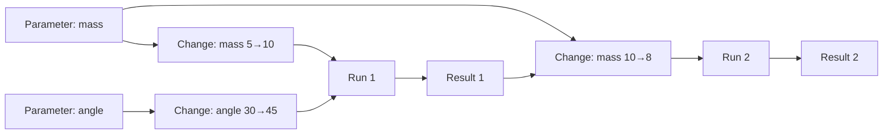
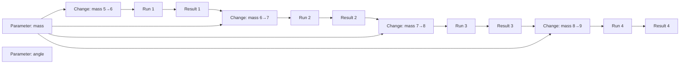
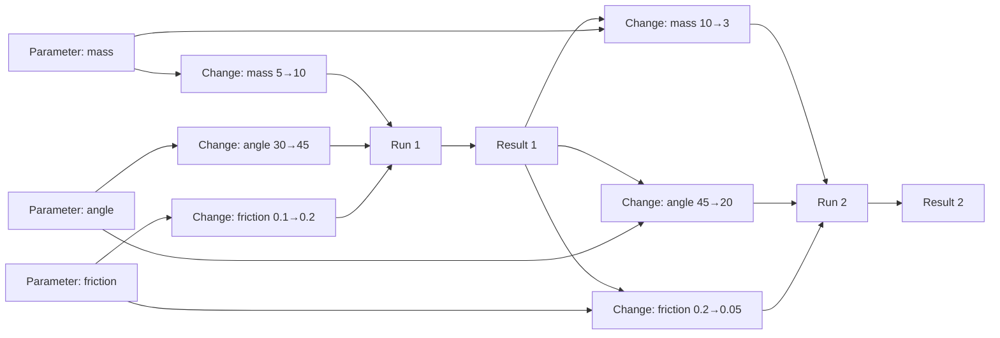

# Simulation Context Graph — Example

A concrete example of what a context graph could look like for a student using a simulation. This expands on the example in [talking-points.md](talking-points.md).

## Scenario

A student runs a simulation twice:

1. **Run 1:** sets mass 5→10 and angle 30→45, presses play, sees Result 1.
2. **Run 2:** after seeing Result 1, changes mass 10→8, presses play, sees Result 2.

## The Graph

## What to Notice

- **Parameters → their changes:** each parameter accumulates its history of changes.
- **Changes → the run that followed:** groups the changes into the run they contributed to.
- **Previous result → next change:** the edge from `Result 1` to `Change: mass 10→8` is the interesting one. It captures that the student saw the first result *before* deciding what to change next.

## Why the Topology Matters

With only two runs the graph is small. Across many runs, the *shape* starts to show exploration patterns:

- A student who sweeps one parameter repeatedly produces a long chain on one parameter node.
- A student who changes everything at once produces wide fan-ins at each run.
- A student who backtracks produces changes that reverse earlier changes.

These shapes are queryable and comparable across students — which is the part that a plain log stream makes hard.

### Pattern: sweeping one parameter

The student leaves angle alone and repeatedly nudges mass, running the simulation after each change. All the action lands on one parameter node, producing a long chain.

Notice that `Parameter: angle` has no changes connected to it, and the result→change→run sequence forms a single linear spine.

### Pattern: changing everything at once

The student changes every parameter before each run. Each run has a wide fan-in of changes, one per parameter.

Each run node has three changes feeding into it. If the student keeps doing this across many runs, every run in the graph has the same fat fan-in signature — a very different shape from the sweeping case.
