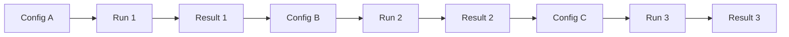
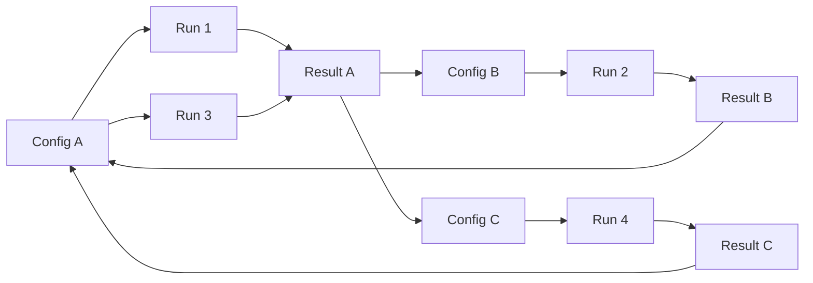
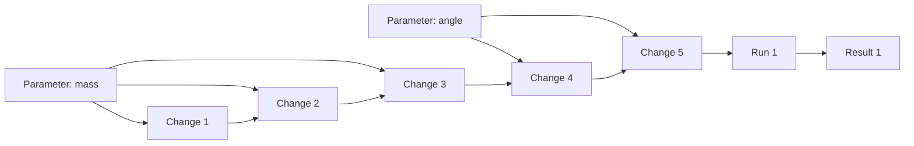

# Identifying Struggling Students — Graphs as One Lens

This is a companion to [simulation-example.md](simulation-example.md). The question here is narrower: **can a graph of a student's interactions help us spot when they're struggling?** I'll try to answer honestly — including the case for *not* using a graph.

## First: What Does "Struggling" Look Like?

Before picking a representation, worth listing the behavioral signals we'd actually care about. In a simulation, "struggling" might look like:

1. **Thrashing** — changing parameters rapidly in no coherent pattern, unlikely to be testing a hypothesis.
2. **Repetition without learning** — running the same configuration multiple times, or making the same change repeatedly.
3. **Long idle gaps** — pausing for a long time between actions. Could mean thinking, could mean stuck.
4. **Extreme value probing** — maxing out or zeroing parameters to "see what happens" rather than testing.
5. **Not pressing play** — making many changes without ever observing the result.
6. **Revisiting old configurations** — going back to settings the student already tried.
7. **Abandonment** — leaving the simulation partway through a task.

## Honest Question: Do We Even Need a Graph?

Several of these signals are easiest to express as simple scalar features:

| Signal | Simple feature |
|---|---|
| Thrashing | Changes per minute |
| Repetition | % changes that match recent changes |
| Idle gaps | Longest gap between events |
| Extreme probing | % changes that hit parameter min/max |
| Not pressing play | Ratio of changes to runs |
| Abandonment | Did they finish the task? |

**If struggle detection is the whole goal, a vector of these features and a simple classifier probably beats a graph.** No need to reach for fancier machinery.

**Where a graph starts to earn its keep** is when you want to go beyond detection and ask:

- "Show me other students whose *pattern* resembled this struggling student's." (similarity by graph shape)
- "At what point did they go off track?" (localizing within the graph)
- "Did seeing Result X *cause* them to start thrashing?" (causal-ish question — needs the edge from result to subsequent action)

So: the graph framing is most valuable for **comparison and explanation across students**, not for binary struggle detection.

## What Nodes Would Go in a Struggle-Sensitive Graph?

If we do want a graph, the base nodes from [simulation-example.md](simulation-example.md) still apply (parameters, changes, runs, results). A few additions would make struggle patterns more visible:

- **Configuration nodes** — one node per *unique parameter state* the student visits. Revisits become self-loops or back-edges in the graph. Shows up the "going in circles" pattern.
- **Idle gap nodes (or edge weights)** — represent a pause as either a node or as a duration weight on the next edge. Long idle weights concentrate on "stuck" moments.
- **Task/goal nodes** — if the activity has sub-goals, a node per goal with edges to the runs that attempted it. Lets us see which sub-goal they stalled on.

## Graph Shapes That Correspond to Struggle Patterns

### Methodical exploration (not struggling)

Changes form orderly chains; each run produces a result that informs the next change.

Linear, forward-moving, few revisits.

### Thrashing / going in circles

The student cycles back to earlier configurations — the graph has back-edges. Many changes, few distinct configurations.

`Config A` is visited repeatedly. A feature like "number of revisited configuration nodes" would flag this graph.

### Changing without observing

Many change nodes, very few run nodes. The graph has lots of change nodes dangling without an attached run.

Five changes before a single run. Suggests the student isn't using the simulation to *observe* — they're just fiddling.

### Stuck (long idle gap before next action)

Hard to show in a static diagram, but if we put time on edges, a single heavy edge between Result and the next Change is the signal. A "stuck" graph has one or two very heavy edges; a fluent graph has many light ones.

## What This Buys Us Beyond Scalar Features

Two things the graph framing adds that scalar features don't:

1. **Localization.** A scalar feature says "this student is struggling." The graph lets us point at *where* — which run, which result triggered the thrashing.
2. **Similarity-based matching.** Once we have graph embeddings for many students, we can ask: "which other students had graph shapes most similar to this one?" — and look at what interventions worked for them. This is the part that connects back to the Neo4j context-graph pitch.

## Caveats

- All of this assumes we can reliably label "struggling" to train or evaluate anything. That's an open research question in itself.
- Graph shape alone won't tell us *why* a student is struggling (conceptual misunderstanding? distracted? frustrated?). It tells us their interaction pattern, which is correlated with but not equal to cognitive state.
- If we want to use this in a dashboard for teachers, we probably surface the scalar features; the graph representation is more useful *behind* the scenes as a way to compute richer features and find similar cases.

## Summary

A graph is probably **not the simplest way** to detect that a single student is struggling in a given moment — scalar features win there. The graph framing becomes valuable when we want to *compare* struggle patterns across students, *localize* where a student went off track, and *retrieve* similar historical cases to inform an intervention. Worth having in the toolkit, but not every problem is a graph problem.
